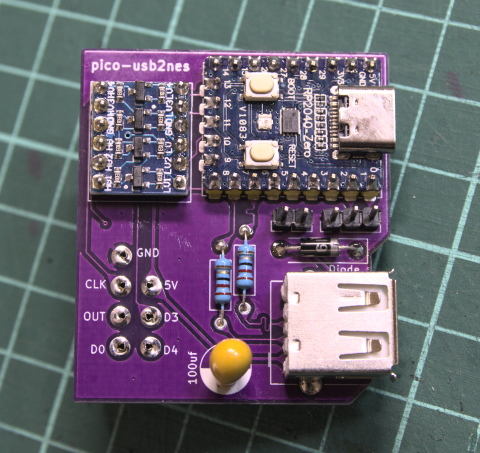

# pico-usb2nes
RP2040 driven USB to controller interface for NES

This is based on the pico-usb2famikb project, using the same library for communicating with the NES/FC, but is focused on connecting to the controller port.

The only mode supported by default is the USB Keyboard Mouse Host mode (see [https://forums.nesdev.org/viewtopic.php?p=202489](https://forums.nesdev.org/viewtopic.php?p=202489) )

